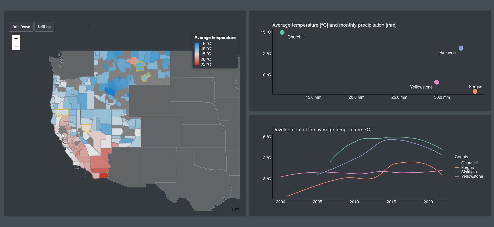

# leafdown@rstudio::conf(2022)

This app allows interactive comparison of weather station measurements across the U.S. at the state 
and county level, as well between individual stations.

The app was primarily developed for my [talk](https://www.rstudio.com/conference/2022/talks/leafdown-interactive-multi-layer-maps/) 
at the rstudio::conf(2022), where I demonstrated the capabilities of the leafdown package.

Data source: https://dev.meteostat.net/python/monthly.html

Link to the app: https://hoga.shinyapps.io/leafdown_rstudio_conf_2022/

 

